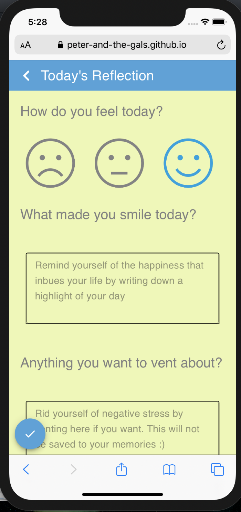
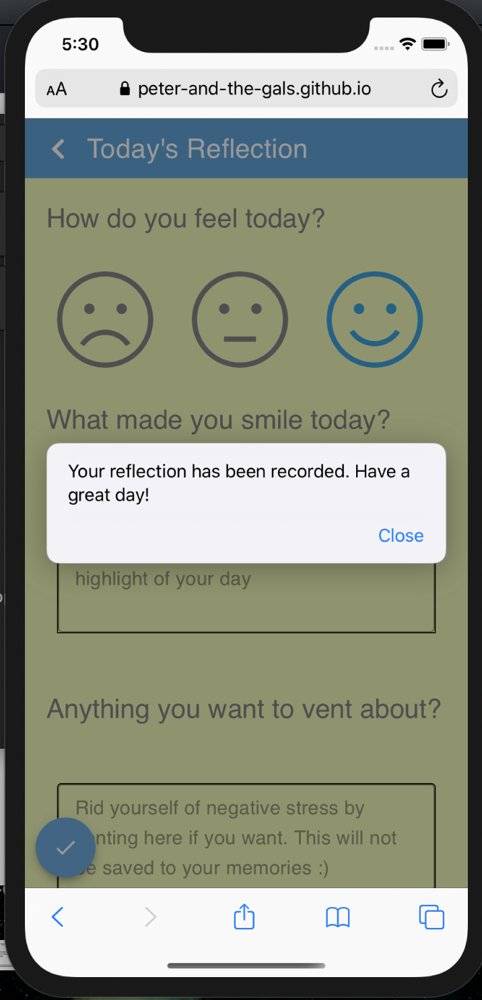
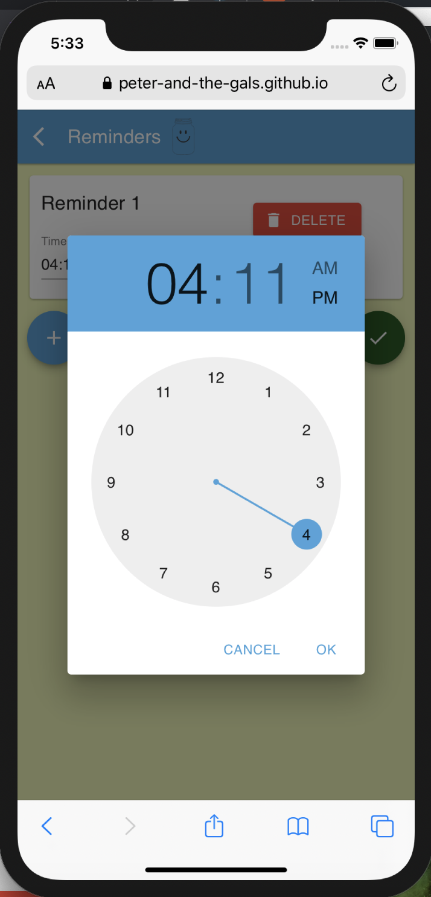

- [High-Fidelity Prototyping (P5, P6, & P7)](#high-fidelity-prototyping-p5-p6--p7)
  - [Overview](#overview)
  - [Tasks, Components and Implementations](#tasks-components-and-implementations)
    - [Reflection](#reflection)
      - [Implementation and Component](#implementation-and-component)
    - [Reminders](#reminders)
      - [Implementation and Component](#implementation-and-component-1)
    - [Weekly And Monthly View](#weekly-and-monthly-view)
      - [Implementation and Component](#implementation-and-component-2)
    - [Happiness Wordcloud](#happiness-wordcloud)
      - [Implementation and Component](#implementation-and-component-3)
    - [Branding, Colours and Design Language](#branding-colours-and-design-language)
- [Appendix](#appendix)
  - [Known Bugs](#known-bugs)
  - [References](#references)

A description of the tasks you decided to support. This should include screenshots of your app, with an explanation of how the various app features were intended to support the task.
A description of your three components you chose to implement

# High-Fidelity Prototyping (P5, P6, & P7)

## Overview
During the past four weeks, we have created a high-fidelity prototype that simulates a user's interaction with the negative bias App - "Happy Jar". We have created three to four components that can facilitate users to reduce their focus on negative biases by supporting the key tasks detailed below that through user interviews and paper prototyping. 

## Tasks, Components and Implementations

### Reflection
Through user interviews and persona analysis, we have ascertained that there is a genuine demand for users to keep track of the thoughts that make them happy and have a place to release the negative energies that hinder their happiness. Users should be able to use HappyJar to record their feelings in a textual manner, guided by quick overviews of their mood through the use of emoticons. 

#### Implementation and Component
We have opted for a data collection form to be implemented that allows users to input their emotions in both a textual and none-textual manner. As shown in Figure 4.1, the reflection form mainly consists of four parts, the emoticon selection radio button, the two text entry boxes and the submit floating action button. 

The forms are designed following the best practices recommended by (Penzo, 2006) and (Babich, 2018), utilising top alignment and reducing the complexity of the perception of complexity and interaction cost, which are particularly important for mobile forms. To this end, we have used an colour overlay to represent an emoticon selection, while making the labels for the fields natural questions as opposed to statements. e.g. "How do you feel today?" vs "Your emotional state:". 

Figure 4.1- The Reflection Form

Lastly, per user testing, we have introduced a feedback system where the app would confirm that a user's reflection has be recorded (Figure 4.2).

Figure 4.2 - Active Confirmation

### Reminders
The same persona analysis points out the importance for a more active system where users could be reminded to feel happy and record the aspects of their lives that they are happy about. Users should be able to set reminders at different times and not be subjected to only one reminder per day unlike other competitors.

#### Implementation and Component
To implement this task, we have designed an interactive reminder page where users could add as many reminders as needed. By positioning the floating action buttons directly under the helper texts, we ensure that users can find it with relative ease. Every time a user presses the add button, a new reminder cell will be created, allowing users to modify the time they wish to be reminded on. 

Figure 4.3 - Adding reminders

Changing the time of the notification has also been optimised for a mobile interface. The large clockface is shown with dragging enabled. This emulates the experience of an native application and has a direct natural mapping(Figure 4.4). This consistute as an advanced form with a more novel data collection field.

Figure 4.4 - Clock face 

### Weekly And Monthly View
After recording one's thoughts and feelings, many users reported that looking back and reflect is also very important to their personal growth. As such, we have designed two pages one supporting a more short term weekly reflections and another for a monthly overview where a specific day of the month could be selected and the user's reflection associated with the day thereof is displayed.

#### Implementation and Component
In the weekly view, a series of cells are displayed to represent the reflections in the week. To promote positive thinking, we have only colour-coded the cells using two colours corresponding with the feeling good and feeling alright emoticon on the reflection page (Figure 4.5).

Figure 4.5 - Weekly Overview

For the monthly view, we employed a mobile friendly Month and Year selection field for the user to narrow down the range they wish to look back at(Figure 4.6). After this range is selected, users can select the specific day they wish to look back at using the custom calendar. A reflection cell, similar to those used in the weekly view shall contain the reflections of the day the user selected(Figure 4.7) Note that this prototype is mainly for illustrating the functionality visually. Some interactions are not implemented. 

Figure 4.6 - Mobile Friendly Month and Year Selector

Figure 4.7 - Monthly Overview Page

### Happiness Wordcloud
As a more advanced reflection feature, the Happiness wordcloud enables users to have a high level perspective of the aspects of their lives that make them happy. This could offer insights to the users on how to further improve their well-being. Through the Happiness Wordcloud, the users can select the mood, date-range to generate a word cloud whose entry and their reflective sizes are based on a statistical analysis of the reflections that the users entered in the period thereof.

#### Implementation and Component
As shown in Figure 4.8, the page consists of three main parts. Namely, an emoticon selector consistent with the one used in the reflection page, a date range selector(Figure 4.9), and a generated WordCloud. The emoticon and the date range filters for the data-range, while the word cloud is a d3 powered visualisation on the data queried by the two filter mechanisms. Again, this is a proof of visual concept as no real database query has been performed.

Figure 4.8 - Happiness WordCloud

### Branding, Colours and Design Language
Three goals for our Happiness Jar Brand and three and emotional states we are trying to achieve are: 1) Calming, 2) Balance, and 3) Happy!
	Based on our research some of the “most calming colors” tend to be blue, green, yellow, gray, and violet (Angela Wright, “Psychological Properties Of Colours.”)(Inam Sarah Pangin,  “7 Relaxing Colors and How They Affect Your Mood!.” ). According to Elliot and Maier, “Color is a ubiquitous perceptual stimulus that is often considered in terms of aesthetics.” In an article titled, "Color Psychology: Effects of Perceiving Color on Psychological Functioning in Humans" they review theoretical and empirical work that looks beyond color aesthetics to the link between color and psychological functioning in humans. They explicitly highlight blue and green for having positive links in the natural realm (e.g., blue sky and water, green foliage and vegetation) and both have been shown to be associated with positive content (Andrew J. Elliot and Markus A. Maier "Color Psychology: Effects of Perceiving Color on Psychological Functioning in Humans"). 
  
Blue is incredibly tied to Openness and Peace, “Certainly, it is a soothing, calming color, encouraging reflection. Nature uses it in the sky and the sea. Strong blues stimulate clear thought and lighter, soft blues calm the mind and aid concentration” (Kurt, S., & Osueke, K. K. (2014). The Effects of Color on the Moods of College Students.). Green is incredibly tied to Calmness and Success “It gives a sense of refreshment, harmony, and equilibrium. It symbolizes universal love, environmental awareness, and peace” (Kurt, S., & Osueke, K. K).

Furthermore, “red and yellow were posited to be stimulating, to prompt an outward focus, and to produce forceful action, whereas green and blue were posited to be relaxing, to encourage an inward focus, and to produce calm and stable action.” This motivated our team to play with and ultimately implement a base color palette of green, blue, and gray. The areas with red on our app are only ones that intend to produce forceful action such as our Reminder buttons. 
  
For our app, we wanted to use calm colors as our base to fulfill our goals and make green and/or blue the focal color for creating a palette. We played with lots of Analogous palettes ranging from (purple to blue, blue to yellow), and complementary palettes (blue and orange, purple and yellow), and even some monochromatic palettes (a spectrum of blue and and a spectrum of green). It was also important to find the perfect shade of blue and green, as different shades and intensities of these colors stimulate us differently. For example Dark Blues or “Strong blues stimulate clear thought and lighter, soft blues calm the mind and aid concentration” (Kurt, S., & Osueke, K. K.).

Using color brewer, we choose a multi-hue analogous scheme of green and blue including (#e0f3db, #a8ddb5, #43a2ca) to be the base for our app. Text throughout our app is mostly gray as it tends to be a super calming color as well, with other contrasting colors littered about to keep the user engaged.

Moreover, we have adopted the material design philosophy for the pages designed. This is done with two considerations in mind. Firstly, Material design is widely used and accepted as one of the principal UI design paradigm for mobile devices. With Android and Google technologies attaining such prevalence, this standard provides a sense of consistency for the user. Secondly, material design especially with the way shadows are used creates depth in such a way that maintains the affordance of the UI element one associate with a traditional computer interface, while still remain visually pleasing through the use of bright colours and the semi-flat design. 

>A material metaphor is the unifying theory of a rationalized space and a system of motion. Our material is grounded in tactile reality, inspired by our study of paper and ink, yet open to imagination and magic.

"Paper" is a major element of material design utilised in the App. In short, it provides an elevation that separates the elements in the paper against the background, accentuating the contents contained within. Looking back to figure 4.6 for instance, the month and year selection has a visual simile to a real paper. This tactile parallel to paper provides a natural and initiative mapping to the real world, emphasising the selection, while not compromising the modern visual attributes. 

Indeed, the use of dimensionality is one that the app considered thoroughly in its design. In Figure 4.5, a traditional grid is no longer demarcated by lines but rather through the natural lighting and the shapes of the cells. This relationship directly informs the users on the hierarchy of the visual elements such as on how the reflections are of equal footing to one another while following down temporally. 

The minimalist design pattern creates a strong emphasis on user driven actions. This is best represented through the floating action buttons employed in the various pages. These FABs, while not containing any texts, uses iconography to communicate the actions they intended. Looking at figure 4.3 and 4.1, one could immediately determine that these buttons not only floats(hence the floating action buttons) creating a sense of dimensionality, but they also disrupts the flow of the document in such a way that uses emphasis to create contrasts. This accentuates the functionality and illuminates the waypoints for the users.

# Appendix 

## Known Bugs

## References

https://www.smashingmagazine.com/2018/08/best-practices-for-mobile-form-design/
https://www.uxmatters.com/mt/archives/2006/07/label-placement-in-forms.php
