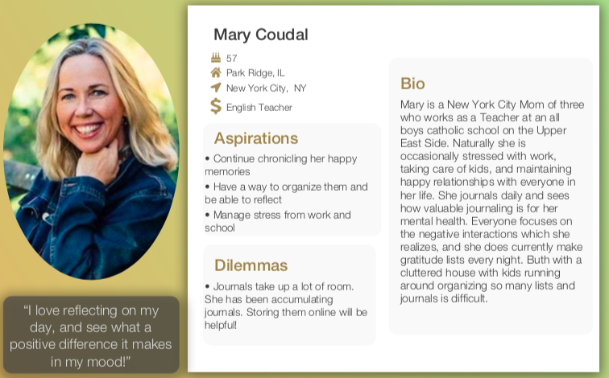
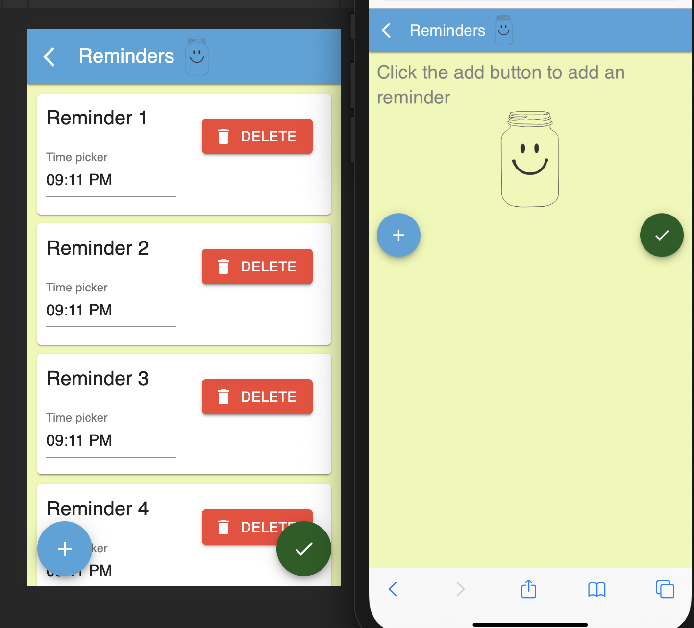
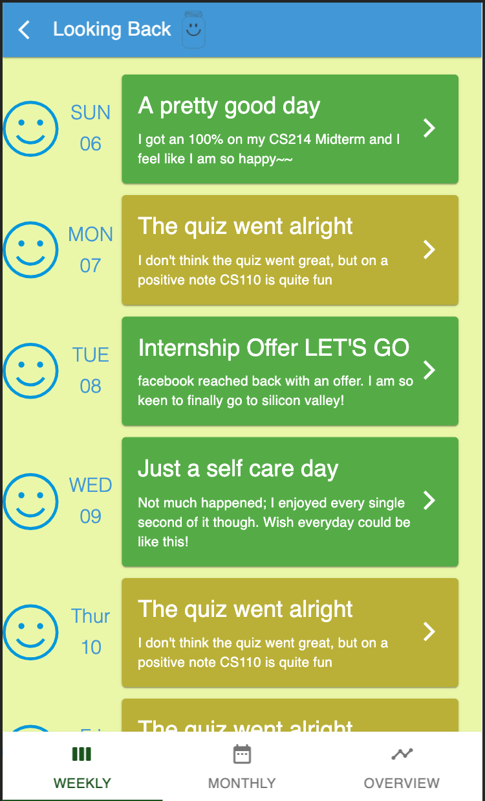
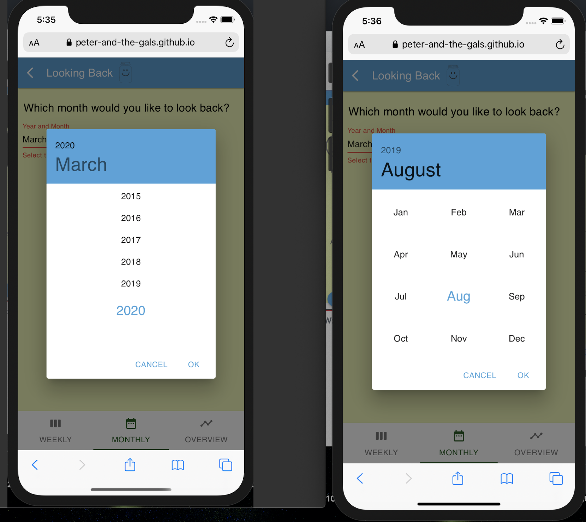
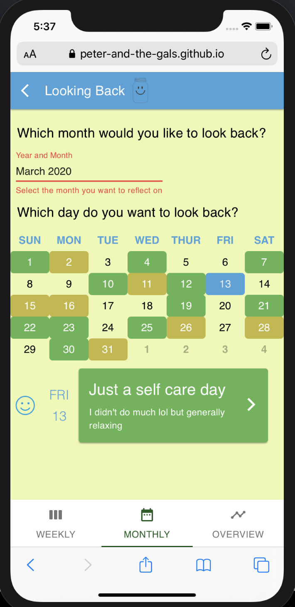
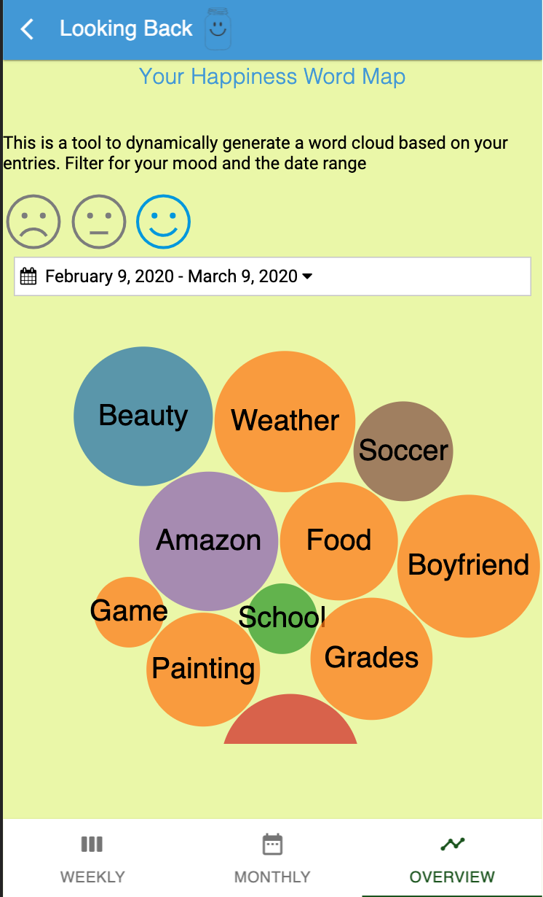

- [Problem & Related Work (P1)](#problem--related-work-p1)
  - [Problem](#problem)
  - [Related Work](#related-work)
  - [Reflect/Self-Driven- Daylio](#reflectself-driven--daylio)
  - [Active, Activity Driven- Happify](#active-activity-driven--happify)
  - [Limitations of Existing Apps](#limitations-of-existing-apps)
- [User Research (P2 & P3)](#user-research-p2--p3)
  - [Research Goals](#research-goals)
  - [Research Approach](#research-approach)
  - [Research Findings](#research-findings)
  - [Target User Population](#target-user-population)
  - [Lessons Learned](#lessons-learned)
- [Paper Prototyping](#paper-prototyping)
- [High-Fidelity Prototyping (P5, P6, & P7)](#high-fidelity-prototyping-p5-p6--p7)
  - [Overview](#overview)
  - [Tasks, Components and Implementations](#tasks-components-and-implementations)
    - [Reflection](#reflection)
      - [Implementation and Component](#implementation-and-component)
    - [Reminders](#reminders)
      - [Implementation and Component](#implementation-and-component-1)
    - [Weekly And Monthly View](#weekly-and-monthly-view)
      - [Implementation and Component](#implementation-and-component-2)
    - [Happiness Wordcloud](#happiness-wordcloud)
      - [Implementation and Component](#implementation-and-component-3)
    - [Branding, Colours and Design Language](#branding-colours-and-design-language)
  - [References](#references)
- [Reflection](#reflection-1)
  - [Stages of Evolution for the Home Page](#stages-of-evolution-for-the-home-page)
      - [Paper Prototype:](#paper-prototype)
      - [First Draft:](#first-draft)
      - [Second Draft:](#second-draft)
      - [Final Draft:](#final-draft)
  - [Stages of Evolution for the Weekly Overview Page](#stages-of-evolution-for-the-weekly-overview-page)
      - [Paper Prototype:](#paper-prototype-1)
      - [First Draft:](#first-draft-1)
      - [Final Draft:](#final-draft-1)
  - [Moving Forward](#moving-forward)
- [Links:](#links)

# Problem & Related Work (P1)

## Problem

According to Kendra Cherry in the article What is Negative Bias?, “Research has shown that across a wide array of psychological events, people tend to focus more on the negative as they try to make sense of the world.” People tend to dwell on the negative and as a result, negative news is more likely to be considered truthful. This negative bias, or the tendency to “feel the sting of a rebuke more powerfully than we feel the joy of praise”, causes people to expect the worst in others and let negative aspects of an event influence their decisions more so than the positive aspects. Cherry illustrates the way negative thoughts affect human perspectives in Figure 1. 

Figure 1-1: Negative Bias Example

It is our goal to create an app, HappyJar, to pull people’s focus towards the positive and encourages users to develop more optimistic perspectives. 

## Related Work

##  Reflect/Self-Driven- Daylio

Daylio is an archetypical app focused upon reflective and self-driven improvements. Apps like Daylio are very much akin to keeping a private diary, however with more data driven tracking features built in, it enables users to view their moods from a more macroscopic perspective. Users emeruate the important activities they completed during the day, adding information pertaining to their emotional status as a result of these activities. Users can pinpoint exactly how their mood would react to a particular stimulus or activity from a higher level, thereby increasing self awareness in their own happiness or negative bias. In theory, by providing these revelations to users, they could make more informed and active decisions towards more happy lifestyles, with improvements (or sometimes decline) in happiness available in a data-based and visual format which can be seen in Figure 2. 

Figure 1-2: Screenshot of Daylio

##  Active, Activity Driven- Happify

Rather than taking a passive approach, some apps- like Happify - focus on activities, or sometimes games to instill positive energy in users. Happify places users to different, personalised tracks purportedly based on user inputs and their unique happiness circumstance. The tracks include activities that’s designed to improve various aspects of a user’s life. For instance in some activities, the users are asked to identify the negative thoughts playing their lives, while in other activities users focus on building more positive thoughts and identify the positive things they’ve experienced in their lives. 

Figure 1-3: Screenshots of Happify

## Limitations of Existing Apps

Existing Apps overly rely on individual agency to remind oneself to actively use the apps either through activities or recording one’s thoughts. However, most apps don’t focus on the notification parts, i.e. reminding users that their state of mind may be subject to negative bias at a regular interval.  Further, most apps focus on simply creating happiness without tackling a more fundamental cause of unhappiness- i.e. negative biases. 

Cherry, Kendra. “Why Our Brains Are Hardwired to Focus on the Negative.” Verywell Mind,    Verywell Mind, 11 Apr. 2019, www.verywellmind.com/negative-bias-4589618. 

Huyer, Hugo. “Daylio Review - Why Is It The Best Mood Tracking App In 2019?” Tracking Happiness, 15 Aug. 2019, www.trackinghappiness.com/daylio-review/.

Konecky, Perri. “Happify: For Stress and Worry.” POPSUGAR Fitness Australia, 26 Apr. 2019, www.popsugar.com.au/fitness/photo-gallery/46078061/image/46081256/Happify-Stress-Worry.

# User Research (P2 & P3)

##  Research Goals

Through our research we aimed to create a more clear picture of the user population for the HappyJar app. In addition, we used research to start compiling lists of features that are either necessary or beneficial to the success of HappyJar. Our research allowed us to look into our potential users daily lives and preferences so that we can create an app that is useful to all people. 

## Research Approach

A shared balance between interviews and task-oriented contextual inquiry are utilised. Interviews allowed the team to ascertain how the users subjectively perceive the problem space gathering more details on how the user’s experience with other alternatives or mood tracking apps in general. A contextual inquiry enabled the user to test the design hypothesis directly. We determined, through observations, either how effective the proposed solution can be, along with its shortcomings, and what areas of existing solutions that the users find effective or lacking. 

##  Research Findings

##  Target User Population

The app shall primarily target users who have access to a smartphone and have basic experience with using basic apps. Furthermore, while the app could be used by a broader audience, we hypothesize that younger people under the age of 40 with a greater inclination for behaviour tracking would be more responsive to the ideas presented(i.e. Tracking negative biases). Target users are aware of the need for better mental health and have taken some approach in the past, not limited to tracking or recording, to ameliorate or maintain their state of mind.  However, We postulate that existing users of alternative mood tracking Apps or users of physical journals would be amongst the early adopters, with other people, falling under the pre-established parameters, continued to be targeted.

Some specific potential users of HappyJar are as follows:

Figure 2-1: Example User for HappyJar

Figure 2-2: Example User Scenario for HappyJar

Figure 2-3: Example User for HappyJar

Figure 2-4: Example User Scenario for HappyJar

## Lessons Learned

In conclusion, all users were able to think more positively from self reflection. Each user liked having the ability to physically type out their own reflection and make it personal. Young users were not as aware of their negative bias, but in general the users noticed change in their mood and perspective from completing this test. However, busier users, often the people that most need to take time for reflection, need a stronger reminder to complete their reflections. In addition, older users or middle aged users, would prefer a solution to negative bias that does not include technology. 

However, testing with existing alternatives demonstrated that in some circumstances, a subject’s mood could in fact decline upon reflecting over the day, especially if only done at night and when negative biases aren’t made clear. This observation confirms our assumption that negative biases could affect a person’s wellbeing at least to some extent. Existing reminders feature is also demonstrated to be inadequate in prompting the users for more positive emotion recording and be more flexible to fit a person’s own schedule. In terms of the user experience, an emoticon based system has shown to be quite initiative for persons of all technological skills to use, but must be complemented with a similarly intuitive text entry area. 

Overall, from this test it would be suggested to narrow the target audience for this app to younger (high school and college) students that are technologically inclined. It can also be concluded that the app will need forceful reminders and that users should be able to set their own time for reflection. The reflection page should be prompt for more positive ideas and emotions, and be designed to be more intuitive  to use such as through emoticon integration and prominent text display. 

Based on the first set of interviews, there were mixed reviews.  The subjects thought that in general an app that helps you self reflect and focus on more of the positive things in your life would be a good idea. However, it could become more of a nuisance to people who may not be in the mood to self-reflect and having a constant notification reminding you could be more bothersome than beneficial. The people who focus on negative bias the most may not be the most willing to participate in the app and write down how they are feeling, but some awareness could be conducive. Another takeaway is that what we ask people to write down is very crucial. It shouldn’t sound like it is forcing someone to reflect right at that moment, it should be more open ended so the user can have more room to reflect as they please which demonstrates the importance of custom notifications.

After examining our feedback and sifting through the user scenarios we developed a list of features that are nice to have and a list of must haves:

Figure 2-5: Essential and Nice to Have Featured

# Paper Prototyping

For paper prototyping, we asked 3 different students to test out our design. We asked each tester to perform 4 different tasks with our paper prototype. Our tasks were:
1. Enter something that made you smile for the day
2. Look back at your highlight from Thursday, February 13th
3. Set the time for when you get notifications from the app 
4. Go to your monthly view of your highlights

Our first tester found our paper prototype fairly easy to use. He was confused because we didn't have back buttons. So after our first round of testing, we then added back buttons for the next users to improve our prototype. On the look back page, tester 1 suggested that we should implement a swipe option between weekly and monthly view. Another suggestion was for setting the time of the notifications to change the way we can set the time to a slider instead of typing in the time. 

Our second tester said that he thought everything was pretty clear while he was using our prototype. However, he took some time to complete task 4 and went to settings first to find his monthly view. After finding nothing in settings, he went back to home and went to ‘Look back at it’ and found his monthly view right away. For our paper prototype, we had the settings button in the top right corner of our home page and it was a little small. Our third tester suggested that we made it a bit bigger or incorporate it as one of the sections in the homepage because it was a bit hard to read. On the look back page, he suggested making the monthly view button more integrated on the page and maybe having buttons on the bottom, one that says weekly and one that says monthly so that you can click between the two. 

After users reflect, a second screen shows up with the intention for users to vent about something that is on their mind or stressing them out. Overall, our testers were a little unclear with what they were supposed to write after just having reflected. 

Some directions we pursued based on what we learned was creating a new homepage where instead of having two sections (reflecting and looking back) and a settings button in the corner, we created three sections: reflecting, looking back and settings so that it is easier to find settings. We also combined the two reflection questions onto one page instead of having one pop up after the other so that it is more clear that one if for reflecting and one is more for venting. 

# High-Fidelity Prototyping (P5, P6, & P7)

## Overview
During the past four weeks, we have created a high-fidelity prototype that simulates a user's interaction with the negative bias App - "Happy Jar". We have created three to four components that can facilitate users to reduce their focus on negative biases by supporting the key tasks detailed below that through user interviews and paper prototyping. 

## Tasks, Components and Implementations

### Reflection
Through user interviews and persona analysis, we have ascertained that there is a genuine demand for users to keep track of the thoughts that make them happy and have a place to release the negative energies that hinder their happiness. Users should be able to use HappyJar to record their feelings in a textual manner, guided by quick overviews of their mood through the use of emoticons. 

#### Implementation and Component
We have opted for a data collection form to be implemented that allows users to input their emotions in both a textual and none-textual manner. As shown in Figure 4.1, the reflection form mainly consists of four parts, the emoticon selection radio button, the two text entry boxes and the submit floating action button. 

The forms are designed following the best practices recommended by (Penzo, 2006) and (Babich, 2018), utilising top alignment and reducing the complexity of the perception of complexity and interaction cost, which are particularly important for mobile forms. To this end, we have used an colour overlay to represent an emoticon selection, while making the labels for the fields natural questions as opposed to statements. e.g. "How do you feel today?" vs "Your emotional state:". 

Figure 4.1- The Reflection Form

Lastly, per user testing, we have introduced a feedback system where the app would confirm that a user's reflection has be recorded (Figure 4.2).

Figure 4.2 - Active Confirmation

### Reminders
The same persona analysis points out the importance for a more active system where users could be reminded to feel happy and record the aspects of their lives that they are happy about. Users should be able to set reminders at different times and not be subjected to only one reminder per day unlike other competitors.

#### Implementation and Component
To implement this task, we have designed an interactive reminder page where users could add as many reminders as needed. By positioning the floating action buttons directly under the helper texts, we ensure that users can find it with relative ease. Every time a user presses the add button, a new reminder cell will be created, allowing users to modify the time they wish to be reminded on. 

Figure 4.3 - Adding reminders

Changing the time of the notification has also been optimised for a mobile interface. The large clockface is shown with dragging enabled. This emulates the experience of an native application and has a direct natural mapping(Figure 4.4). This consistute as an advanced form with a more novel data collection field.

Figure 4.4 - Clock face 

### Weekly And Monthly View
After recording one's thoughts and feelings, many users reported that looking back and reflect is also very important to their personal growth. As such, we have designed two pages one supporting a more short term weekly reflections and another for a monthly overview where a specific day of the month could be selected and the user's reflection associated with the day thereof is displayed.

#### Implementation and Component
In the weekly view, a series of cells are displayed to represent the reflections in the week. To promote positive thinking, we have only colour-coded the cells using two colours corresponding with the feeling good and feeling alright emoticon on the reflection page (Figure 4.5).

Figure 4.5 - Weekly Overview

For the monthly view, we employed a mobile friendly Month and Year selection field for the user to narrow down the range they wish to look back at(Figure 4.6). After this range is selected, users can select the specific day they wish to look back at using the custom calendar. A reflection cell, similar to those used in the weekly view shall contain the reflections of the day the user selected(Figure 4.7) Note that this prototype is mainly for illustrating the functionality visually. Some interactions are not implemented. 

Figure 4.6 - Mobile Friendly Month and Year Selector

Figure 4.7 - Monthly Overview Page

### Happiness Wordcloud
As a more advanced reflection feature, the Happiness wordcloud enables users to have a high level perspective of the aspects of their lives that make them happy. This could offer insights to the users on how to further improve their well-being. Through the Happiness Wordcloud, the users can select the mood, date-range to generate a word cloud whose entry and their reflective sizes are based on a statistical analysis of the reflections that the users entered in the period thereof.

#### Implementation and Component
As shown in Figure 4.8, the page consists of three main parts. Namely, an emoticon selector consistent with the one used in the reflection page, a date range selector(Figure 4.9), and a generated WordCloud. The emoticon and the date range filters for the data-range, while the word cloud is a d3 powered visualisation on the data queried by the two filter mechanisms. Again, this is a proof of visual concept as no real database query has been performed. Rather than using a line chart which is more accurate, a word cloud is more intutitive and can be more emotive, fitting this app which is built around emotions.

Figure 4.8 - Happiness WordCloud

### Branding, Colours and Design Language
Three goals for our Happiness Jar Brand and three and emotional states we are trying to achieve are: 1) Calming, 2) Balance, and 3) Happy!
	Based on our research some of the “most calming colors” tend to be blue, green, yellow, gray, and violet (Angela Wright, “Psychological Properties Of Colours.”)(Inam Sarah Pangin,  “7 Relaxing Colors and How They Affect Your Mood!.” ). According to Elliot and Maier, “Color is a ubiquitous perceptual stimulus that is often considered in terms of aesthetics.” In an article titled, "Color Psychology: Effects of Perceiving Color on Psychological Functioning in Humans" they review theoretical and empirical work that looks beyond color aesthetics to the link between color and psychological functioning in humans. They explicitly highlight blue and green for having positive links in the natural realm (e.g., blue sky and water, green foliage and vegetation) and both have been shown to be associated with positive content (Andrew J. Elliot and Markus A. Maier "Color Psychology: Effects of Perceiving Color on Psychological Functioning in Humans"). 
  
Blue is incredibly tied to Openness and Peace, “Certainly, it is a soothing, calming color, encouraging reflection. Nature uses it in the sky and the sea. Strong blues stimulate clear thought and lighter, soft blues calm the mind and aid concentration” (Kurt, S., & Osueke, K. K. (2014). The Effects of Color on the Moods of College Students.). Green is incredibly tied to Calmness and Success “It gives a sense of refreshment, harmony, and equilibrium. It symbolizes universal love, environmental awareness, and peace” (Kurt, S., & Osueke, K. K).

Furthermore, “red and yellow were posited to be stimulating, to prompt an outward focus, and to produce forceful action, whereas green and blue were posited to be relaxing, to encourage an inward focus, and to produce calm and stable action.” This motivated our team to play with and ultimately implement a base color palette of green, blue, and gray. The areas with red on our app are only ones that intend to produce forceful action such as our Reminder buttons. 
  
For our app, we wanted to use calm colors as our base to fulfill our goals and make green and/or blue the focal color for creating a palette. We played with lots of Analogous palettes ranging from (purple to blue, blue to yellow), and complementary palettes (blue and orange, purple and yellow), and even some monochromatic palettes (a spectrum of blue and and a spectrum of green). It was also important to find the perfect shade of blue and green, as different shades and intensities of these colors stimulate us differently. For example Dark Blues or “Strong blues stimulate clear thought and lighter, soft blues calm the mind and aid concentration” (Kurt, S., & Osueke, K. K.).

Using color brewer, we choose a multi-hue analogous scheme of green and blue including (#e0f3db, #a8ddb5, #43a2ca) to be the base for our app. Text throughout our app is mostly gray as it tends to be a super calming color as well, with other contrasting colors littered about to keep the user engaged.

Moreover, we have adopted the material design philosophy for the pages designed. This is done with two considerations in mind. Firstly, Material design is widely used and accepted as one of the principal UI design paradigm for mobile devices. With Android and Google technologies attaining such prevalence, this standard provides a sense of consistency for the user. Secondly, material design especially with the way shadows are used creates depth in such a way that maintains the affordance of the UI element one associate with a traditional computer interface, while still remain visually pleasing through the use of bright colours and the semi-flat design. 

>A material metaphor is the unifying theory of a rationalized space and a system of motion. Our material is grounded in tactile reality, inspired by our study of paper and ink, yet open to imagination and magic.

"Paper" is a major element of material design utilised in the App. In short, it provides an elevation that separates the elements in the paper against the background, accentuating the contents contained within. Looking back to figure 4.6 for instance, the month and year selection has a visual simile to a real paper. This tactile parallel to paper provides a natural and initiative mapping to the real world, emphasising the selection, while not compromising the modern visual attributes. 

Indeed, the use of dimensionality is one that the app considered thoroughly in its design. In Figure 4.5, a traditional grid is no longer demarcated by lines but rather through the natural lighting and the shapes of the cells. This relationship directly informs the users on the hierarchy of the visual elements such as on how the reflections are of equal footing to one another while following down temporally. 

The minimalist design pattern creates a strong emphasis on user driven actions. This is best represented through the floating action buttons employed in the various pages. These FABs, while not containing any texts, uses iconography to communicate the actions they intended. Looking at figure 4.3 and 4.1, one could immediately determine that these buttons not only floats(hence the floating action buttons) creating a sense of dimensionality, but they also disrupts the flow of the document in such a way that uses emphasis to create contrasts. This accentuates the functionality and illuminates the waypoints for the users.

## References

Babich, A. N. (2018, August 28). Best Practices For Mobile Form Design. Retrieved from https://www.smashingmagazine.com/2018/08/best-practices-for-mobile-form-design/

Penzo, M. (2006, July 12). Label Placement in Forms. Retrieved from https://www.uxmatters.com/mt/archives/2006/07/label-placement-in-forms.php

Elliot , Andrew J. and Markus A. Maier "Color Psychology: Effects of Perceiving Color on Psychological Functioning in Humans" Annual Review of Psychology 2014 65:1, 95-120. https://www.annualreviews.org/doi/abs/10.1146/annurev-psych-010213-115035

Kurt, S., & Osueke, K. K. (2014). The Effects of Color on the Moods of College Students. SAGE Open. https://doi.org/10.1177/2158244014525423

Pangin, Inam Sarah. “7 Relaxing Colors and How They Affect Your Mood! - Times of India.” The Times of India, The Times of India, 6 July 2017, timesofindia.indiatimes.com/life-style/health-fitness/de-stress/7-relaxing-colors-and-how-they-affect-your-mood/articleshow/46946305.cms.

Wright, Angela. “Psychological Properties Of Colours.” Colour Affects, www.colour-affects.co.uk/psychological-properties-of-colours.

# Reflection

We had a lot of fun making this project and were able to achieve so much. There was definitely a learning curve for those of us who had never worked with HTML and CSS, and if we were experts we would have been able to do much much more. That said we are so proud of our product!

Some lessons we learned though user testing were 1) Things intuitive to us might not be intuitive to other people 2) Listen to user feedback much more and change design paradigm.

Specifically through paper prototyping we learned:
- Multi Page design is not always the best option(combining the two reflections)
- people want to delete and add multiple reminders
- Using sliders to control time entry as opposed to typing
- make all buttons on the home page equally prominent

Through computer prototyping we learned and were able to accomplish:
- Making the Home Page more clear(per sarah's recommendation)

## Stages of Evolution for the Home Page

#### Paper Prototype:

#### First Draft:

#### Second Draft:

#### Final Draft:

- We learned to add more helper text to make the app easier to use
- We learned to make controls closer to the helper text(the add button closer to the top)
- and we learned through research that for the goals of our project our colour scheme should be calming!

##  Stages of Evolution for the Weekly Overview Page

#### Paper Prototype:

#### First Draft:

#### Final Draft:

We've made the interface more intutive to understand and make sure the colour scheme is consistent with the rest of the UI. The paper model is used in correspondance with the material design paradiym.

## Moving Forward
Moving forward we will implement tags in the reflection so that the word cloud features could be better grouped based on user preferences. A more advanced filtering could also be implementated based on the tags to better allow for the users to search for their memories like certain other reflection based apps. Data persistancy and possible cloud syncing will also need to be added for the app to be fully functional. 

# Links:

Full Prototype Demo:
https://github.com/Peter-and-the-Gals/happyjar/blob/master/Demo.mov

Accessing the Prototype: (Requires Chrome Mobile Simulation set on iPhone)
https://peter-and-the-gals.github.io/happyjar/homepage.html

Paper Prototype:
https://youtu.be/m24XyFg9UEU
